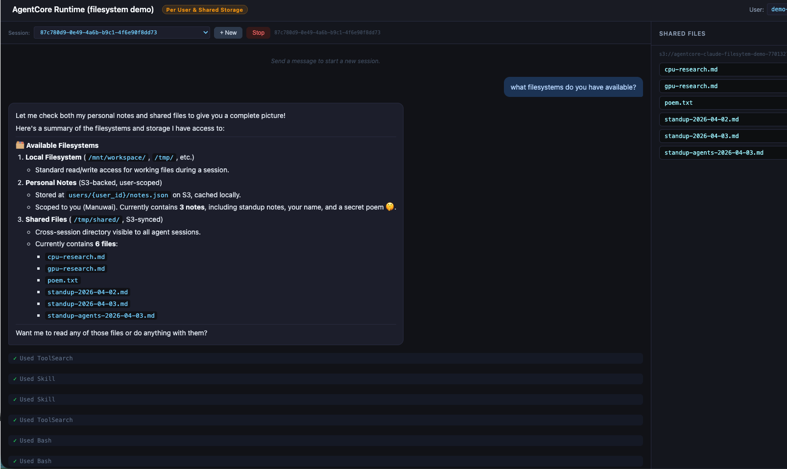

# AgentCore Chat Demo

A generic chat frontend for any AgentCore Runtime agent, with session management and a command runner for inspecting the container filesystem.

Includes a sample agent that demonstrates **managed session storage** (each session gets an isolated `/mnt/workspace`), **S3-backed personal notes** scoped by user, and a **shared workspace** for cross-session file persistence.



## Structure

```
├── app.py                        # FastAPI backend (SSE streaming, exec, session mgmt)
├── index.html                    # Single-page chat UI (served by app.py)
├── deploy.py                     # Build, push, create/update AgentCore Runtime + S3 bucket
├── config.py                     # Shared config (S3 bucket prefix, model ID) — copied into agent build
├── requirements.txt              # Frontend/backend deps (fastapi, uvicorn, boto3)
└── agent/                        # Sample agent deployed to AgentCore Runtime
    ├── main.py                   # BedrockAgentCoreApp + claude_agent_sdk
    ├── Dockerfile
    ├── requirements.txt
    └── .claude/
        └── skills/
            ├── personal-notes/   # Skill: save/retrieve personal notes (S3, per-user)
            └── shared-files/     # Skill: manage shared files (S3, cross-session)
```

## Setup

Create a venv and install deps (requires latest boto3/botocore for `filesystemConfigurations`):

```bash
python -m venv .venv
source .venv/bin/activate
pip install -U -r requirements.txt
```

## Deploy the sample agent

Requires Docker and AWS credentials with ECR + IAM + AgentCore + S3 permissions.

```bash
python deploy.py            # creates IAM role, S3 bucket, ECR repo, builds/pushes image, creates runtime
python deploy.py --destroy  # tears it all down (including S3 bucket)
```

## Run the chat app

```bash
AGENT_RUNTIME_ARN="<arn printed by deploy.py>" python app.py
```

Open http://localhost:8080

Point `AGENT_RUNTIME_ARN` at any HTTP-protocol AgentCore runtime — the chat UI is not specific to the sample agent.

## Demo walkthrough

### Part 1: Per-user personal notes (S3-backed)

Notes are synced to S3 under `users/{user_id}/notes.json`. Change the **User** field in the header to switch users.

1. Set the user to `alice` and send *"Save a reminder for Monday 9am to review the PR"*
2. In the sidebar, click **Run** to execute `cat /mnt/workspace/notes.json` and see the local cache
3. Click **+ New Session** and ask *"What are my notes?"* — Alice's notes persist across sessions via S3
4. Change the user to `bob` and ask *"What are my notes?"* — Bob has no notes (user isolation)
5. Save a note as Bob, then switch back to Alice — each user sees only their own notes

### Part 2: Shared storage (S3 sync)

Files in `/tmp/shared/` are instantly synced to S3 via the shared-files skill, making them visible across all sessions and users.

1. In any session, send *"Save a shared file called team-standup.txt with the notes from today's meeting"*
2. In the sidebar, click **Run** to execute `ls /tmp/shared/` and confirm the file was created
3. Click **+ New Session** and ask *"What shared files are available?"* — the file from the other session appears
4. Ask *"Read the shared file team-standup.txt"* — the content is available across sessions
5. Send *"Add a line to team-standup.txt with an action item"* — the update syncs back to S3 and is visible from any session
